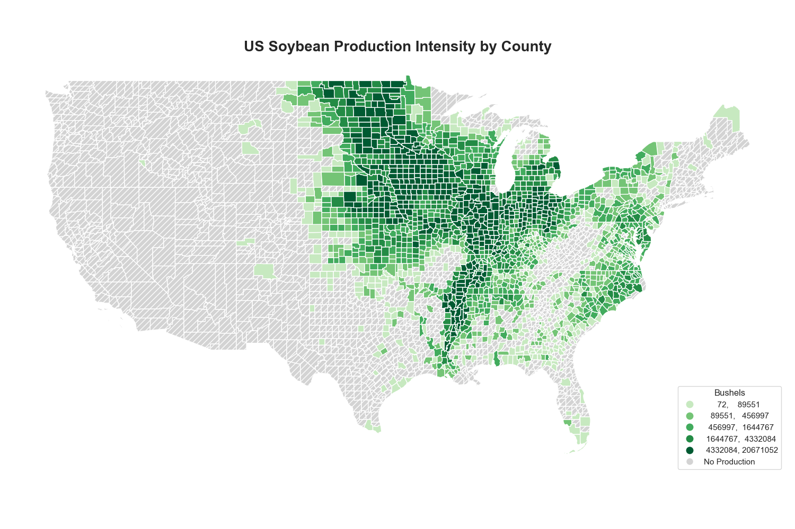
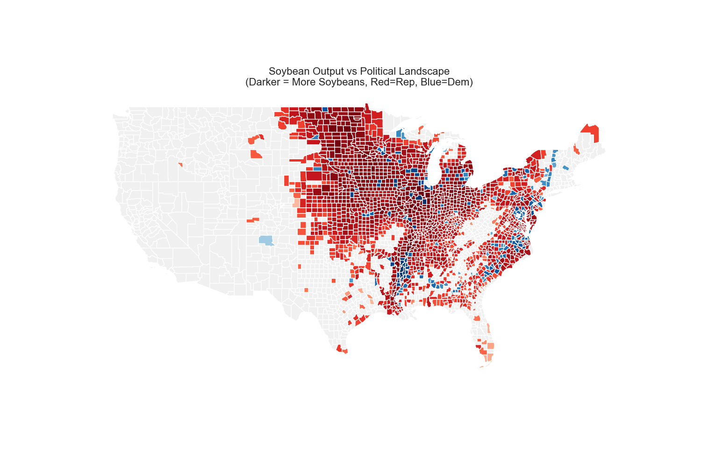
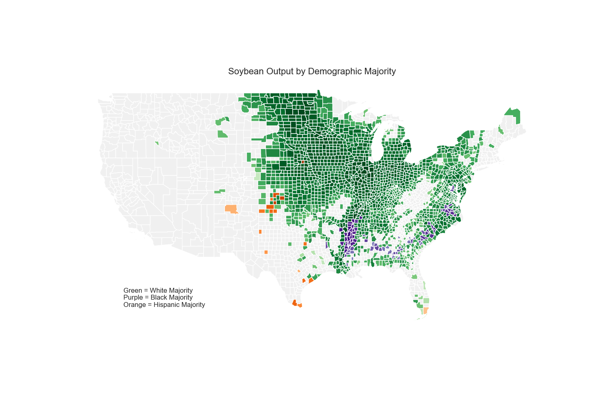
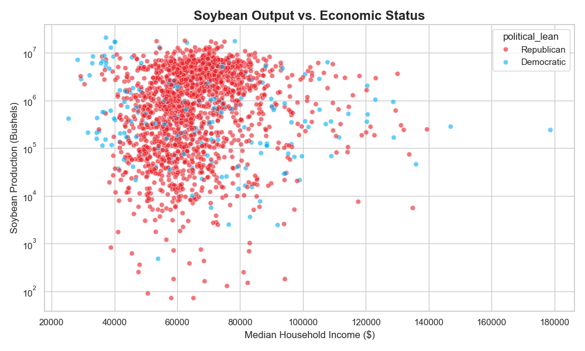

# US Soybean Production: Allocation & Socio-Political Analysis

## Project Overview
This project visualizes the allocation of soybean output across the United States and analyzes the correlation between high-production zones and key socioeconomic factors.

The goal is to understand the profile of America's soy-producing counties by cross-referencing agricultural output data with:
* **Political Stance:** 2024 Presidential election results.
* **Demographics:** Racial and population distribution.
* **Economics:** Income levels and economic status.

## Key Visualizations

### 1. The Soybean Landscape
A baseline map showing the geographic allocation of US soybean output, highlighting the major production hubs.

### 2. Soybean Production & Politics
This map overlays political data onto production zones to visualize the correlation between soy output and political alignment in the 2024 election.

### 3. Racial Demographics & Production
A geographical overlay showing how soybean production intensity intersects with racial demographic distributions, highlighting the demographic composition of key agricultural counties.

### 4. Economic Indicators
A scatter plot analysis exploring the relationship between soybean production intensity and local income levels/economic status.

---

## Technical Details
* **Language:** Python
* **Key Libraries:** `pandas`(Data Analysis), `matplotlib` / `seaborn`/`geopandas` (Visualization)
* **Data Sources:** * USDA 2022 Census of Agriculture Data (Soybean Output)
    * 2024 County-Level Presidential Election Results
    * US Census Bureau (Demographics & Economic Data)

## How to Run
1.  Clone this repository
2.  Install required dependencies
3.  Run the main analysis script
